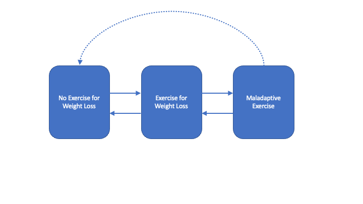

# Analytic Plan

Analyses will be gender stratified. The primary predictor variable of interest is time, with the purpose of investigating persistence and changes in exercise behavior over adolescent and young adult development. Secondary predictors include: BMI-Z score at age 13 and Eating Disorder Cognitions at Age 14. Parent SES will be entered as a covariate as it is possible, though not hypothesized, that exercise patterns may vary based on socioeconomic status. 

## Multi-State Transition Analyses

The first step in analyses will evaluate overall changes in the presence of exercise for weight loss and maladaptive exercise over time in the sample. Visualization will be completed with transition plots [@cernatVisualizingTransitionsTime2021] for those completing all four assessment points. For those completing at least two assessment points, transition analysis will include multi-state Markov models for panel data [@jacksonMultistateModellingMsm], the implementation of which on the current data will describe how individuals move between the 'No EWL', 'EWL', and 'Maladaptive Ex' groups over time, with transition intensities representing the instantaneous risk of moving between these three groups. An initial transition matrix will be specified in which instantaneous transitions between adjacent states are permitted, as well as transitions between the Maladaptive Ex-No EWL state (direct transition to exercise abstinence). If initial models do not converge, direct transitions from Maladaptive Ex to No-EWL will also be constrained to 0, such that a sojurn through the EWL state is required (See \@ref(fig:transfig)) Transition analyses will be completed separately for boys and girls, and the fitted transition probability matrix, $P(t)$ will be reported over an interval of 1-year, which will describe the liklihood of transition between exercise groups in a given year during the study time frame. Exploratory analysis of transition states will examine whether baseline covariates (Parent SES, BMI-Z at age 13 years, eating disorder cognitions at age 14 years) impact transition intensities amongst the three exercise groups.  

```{r transfig, fig.cap = 'Transitions between Exercise Groups', out.width= '90%'}

```


## Missing Data

Prior to mixed-effects modeling, missing data will be imputed using the `mice` and `miceadds` packages [@R-mice; @R-miceadds]. Data to be imputed is included in Supplemental Table \@ref(tab:imptab). A mixed-model approach to imputation will be used. Time-invariant variables will be imputed at level-2 only using a Predictive Mean Matching (PMM) approach, and outcome variables will be imputed using 2-level approaches, which consider time (see Supplemental Table \@ref(tab:imptab)). Datasets for girls and boys will be imputed separately, with 20 imputed datasets. In addition to covariate and predictor variables, parent education was also included in the imputation model specifically to improve imputation of highest parent occupation (measure of SES).

## Mixed Effects Modeling

Mixed Effects Models for ordinal and binary data [@christensenAnalysisOrdinalData2015; @christensenTutorialFittingCumulative2019; @landermanModelingRepeatedMeasures2011] will examine whether levels of exercise for weight loss and maladaptive exercise change across age. Parameter pooling will be utilized to combine models fit to the imputed datasets.

Nested models will be built  will allow for a random intercept for each individual, then a fixed effect of Time (assessment point - with baseline set to 14 years), followed by fixed effects for all baseline predictors and covariates, and, finally, all Predictor x Time interactions. Models will be compared via the multivariate Wald test (using the D3 statistic, as recommended) [@buurenMiceMultivariateImputation2011]. Parameters for each model are presented in Supplement (Chapter \@ref(supp1) ). 

